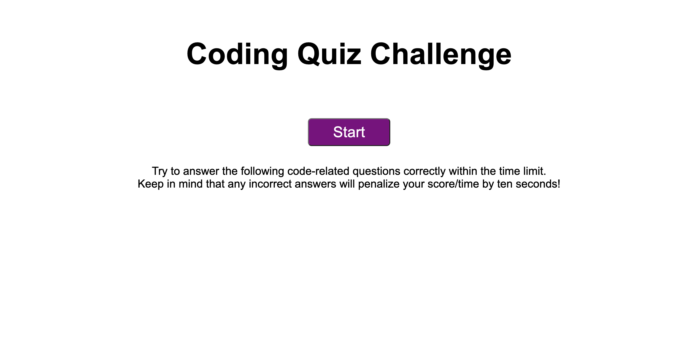

# Javascript-Fundamentals-Quiz

## Description

This website showcases a javascript quiz. The first screen will show the title of the quiz, basic instructions, and have a start button. Once the start button is clicked, the user could take the quiz. The quiz will notify the user if they got the question correct or incorrect. Once the quiz is finished, the user could add their highscore to the quiz or even retake the quiz. This website contains notes on HTML, CSS. and JavaScript. 
Here is the link to the website: https://jssoyoung.github.io/Javascript-Fundamentals-Quiz/
Here is an image of the website: 

## Installation

N/A

## Usage

The website is divided into many sections. In the beginning, parts of the page are hidden and portrays only the start screen. The start screen holds the title, instructions for the quiz, and a start button. Upon clicking the start button, the main section becomes visible. This main section holds an array of quiz questions. If the user clicks the correct answer, they are alerted with text-box that tells them they got the question correct, along with getting 20 points added. If the user gets the incorrect answer, they are then alerted with a text-box that tells them the answer is wrong and that they got 10 seconds deducted from their total time. The timer and score are displayed at all times during the main quiz. Once the user answers all five questions, they are able to add in their initials and click the button that says submit. If the submit button is clicked, the user will then be shown the last section, which holds the highscores screen. Their initials and score are then added to a highscore chart. The user is given the option to either restart the quiz if they wish. If they click the restart button, they will be taken back to the start screen and can begin again.

## Credits

N/A 

## License

Please refer to the LICENSE in the repo.
